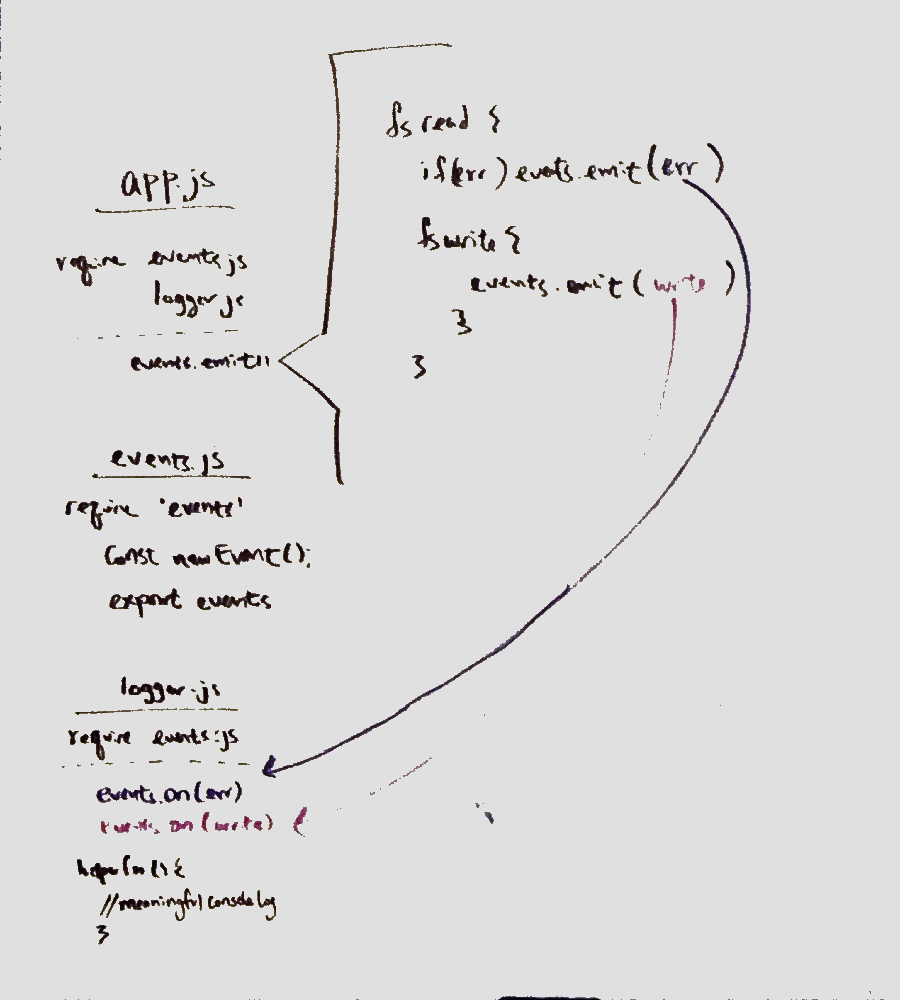

# LAB - 16

## Event Driven Applications

### Author: Brandyn Vay

### Links and Resources
* [submission PR](https://github.com/brandyn-vay-401-advanced-javascript/lab-class-16)
* [travis](https://travis-ci.com/brandyn-vay-401-advanced-javascript/lab-class-16)

#### Documentation
* [jsdoc](http://localhost:3000)

### Modules
#### `events-module.js`
#### `logger-module.js`

#### Running the app
* `node app.js file.txt `

  
#### Tests
* How do you run tests? Run npm test in terminal

#### UML

